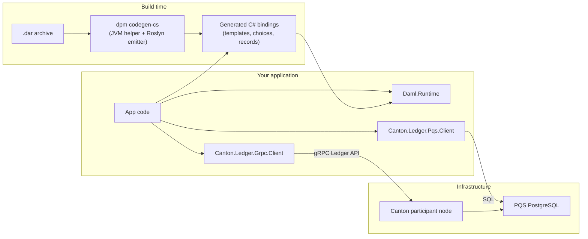
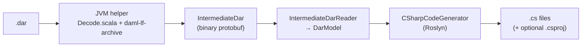
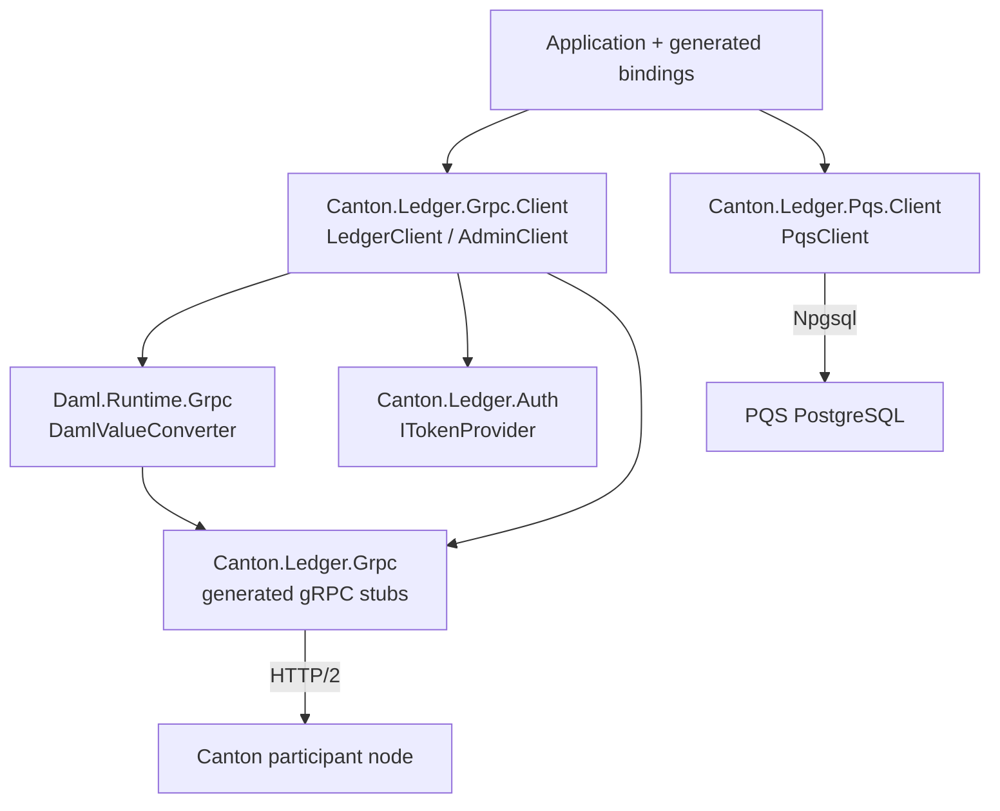
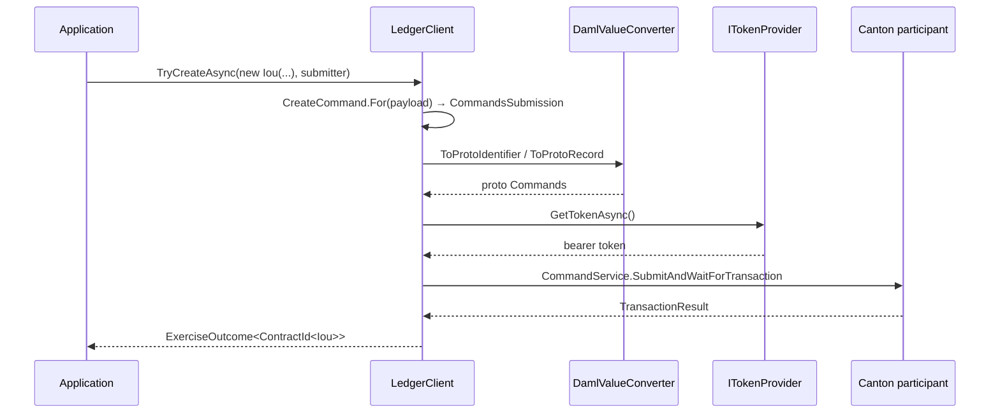

# Architecture Overview

This document describes how the Canton .NET SDK fits together: the code-generation pipeline that turns a Daml archive (`.dar`) into C# bindings, the `Daml.Runtime` library those bindings depend on, and the `Canton.Ledger.*` client packages (this repository) that talk to a Canton participant node over gRPC and to the Participant Query Store (PQS) over PostgreSQL.

## The big picture

The SDK is split across two repositories:

| Repository | Ships |
|---|---|
| [`daml-codegen-csharp`](https://github.com/peacefulstudio/daml-codegen-csharp) | The codegen pipeline (`dpm codegen-cs`) and the `Daml.Runtime` / `Daml.Ledger.Abstractions` NuGet packages |
| `canton-ledger-api-csharp` (this repo) | The `Canton.Ledger.*` and `Daml.Runtime.Grpc` NuGet packages |



Three layers, three lifecycles:

1. **Codegen** runs at build time (or in CI) and never ships with your application.
2. **`Daml.Runtime`** is the runtime vocabulary shared by generated code and the clients: Daml values, identifiers, command types.
3. **`Canton.Ledger.*`** is the transport layer: gRPC for command submission and transaction streams, PostgreSQL for PQS queries.

## The codegen pipeline

Code generation lives in [`daml-codegen-csharp`](https://github.com/peacefulstudio/daml-codegen-csharp) and is a two-stage pipeline bridged by a protobuf intermediate format. The split exists because the authoritative Daml-LF decoder (`daml-lf-archive`) is a JVM library, while the emitter targets the .NET ecosystem.



### Stage 1: the JVM helper

A small Scala tool wrapping Digital Asset's `daml-lf-archive` library. It reads the `.dar`, decodes each package in *schema mode* — signatures only, expressions and choice bodies stripped — and emits a single binary-protobuf `IntermediateDar` message. Schema-mode decoding makes the output insensitive to Daml-LF patch versions: two DARs differing only by patch version produce byte-identical intermediate output, which keeps the emitter deterministic.

The intermediate format (`intermediate_dar.proto`) carries the complete type surface: modules, data types (records, variants, enums), templates with their choices, keys, signatories and observers, and interfaces with methods and view types. The JVM helper runs only at codegen time; it is **not** a runtime dependency of generated packages or applications.

### Stage 2: the C# emitter

The .NET side (`Daml.Codegen.CSharp`) parses the `IntermediateDar` protobuf into an in-memory model and walks it with a Roslyn-based generator, emitting:

- **Templates** — sealed records implementing `ITemplate`, with a static `TemplateId`, typed `ContractId<T>`, and `ToRecord()`/`FromRecord()` serialization.
- **Choices** — nested types on their template (e.g. `Iou.Transfer`) with `ExerciseCommand` builders.
- **Records, variants, enums** — sealed records implementing `IDamlRecord`, variant hierarchies implementing `IDamlVariant`, and C# `enum`s.
- **Interfaces** — types implementing `IDamlInterface`, with `IHasView<TView>` and `IImplements<TInterface>` linking templates to the interfaces they implement.
- Optionally a `.csproj`, so a DAR can be turned directly into a NuGet package.

### Invocation

The pipeline ships as a `dpm` component (an OCI artifact bundling the JVM helper and a self-contained .NET emitter per platform — no host .NET runtime required):

```bash
dpm codegen-cs --dar ./contracts.dar --out ./Generated -n MyCompany.Contracts
```

## The runtime: `Daml.Runtime`

`Daml.Runtime` is a NuGet package published from [`daml-codegen-csharp`](https://github.com/peacefulstudio/daml-codegen-csharp). It is the shared vocabulary between generated bindings and the ledger clients — this repository consumes it as a dependency (the pinned version lives in `Directory.Packages.props`; currently `0.1.8-preview.1`) and deliberately does not re-implement any of it.

Its main areas:

| Namespace | Provides |
|---|---|
| `Daml.Runtime.Contracts` | `ITemplate`, `IDamlInterface`, `ContractId<T>`, `Contract<T>`, key/view/implements markers |
| `Daml.Runtime.Data` | The `DamlValue` hierarchy (`DamlInt64`, `DamlNumeric`, `DamlText`, `DamlParty`, `DamlDate`, `DamlTimestamp`, `DamlContractId`, `DamlList<T>`, `DamlOptional<T>`, `DamlTextMap<T>`, `DamlRecord`, `DamlVariant`, …), `Identifier`, and `DamlValueExtensions.FromDamlValue<T>` for unwrapping values to CLR types |
| `Daml.Runtime.Commands` | Transport-agnostic `CreateCommand`, `ExerciseCommand`, `CommandsSubmission`, `SubmitterInfo` |
| `Daml.Runtime.Serialization` | `DamlJsonSerializer` for Ledger API JSON |
| `Daml.Runtime.Stdlib` | Daml standard-library mappings (`Tuple`, `Either`, `Set`, `Map`, `NonEmpty`, …) |

Generated code targets these types; the clients in this repository accept and return them. The companion package `Daml.Ledger.Abstractions` defines the transport-agnostic `ILedgerClient` interface that `Canton.Ledger.Grpc.Client` implements.

## The gRPC ledger client (this repository)



### `Canton.Ledger.Grpc` — generated stubs

The lowest layer: C# gRPC stubs compiled from the official Canton Ledger API v2 protos. Proto files are **not** checked in; `DownloadProtos.targets` fetches them at build time from Maven Central (the `com.daml:ledger-api-proto` and `com.daml:ledger-api-value-proto` artifacts for the Canton version pinned as `CantonVersion` in `Directory.Build.props`, plus Google common protos) and `Grpc.Tools` compiles them. The result is one client stub per Ledger API service: `CommandService`, `UpdateService`, `StateService`, `PartyManagementService`, `UserManagementService`, `PackageManagementService`, and `PackageService`.

### `Daml.Runtime.Grpc` — the value bridge

A thin, bidirectional converter between the proto `Value` types from `Canton.Ledger.Grpc` and the `Daml.Runtime.Data` value hierarchy: `DamlValueConverter.ToProtoValue` / `FromProtoValue` (and the record/identifier variants). It covers the full Daml value surface — unit, bool, int64, text, party, numeric (canonical unpadded encoding), date, timestamp, contract ID, record, variant, enum, list, optional, text map, gen map. This package only bridges representations; value unwrapping and typed decoding stay in `Daml.Runtime`.

### `Canton.Ledger.Grpc.Client` — the high-level client

The package applications actually use. Two entry points:

- **`LedgerClient`** (`ILedgerClient`) wraps `CommandService`, `UpdateService`, and `StateService`:
  - `TryCreateAsync<TTemplate>(payload, submitter)` — create a contract from a generated template record; returns a typed `ContractId<TTemplate>` outcome.
  - `TryExerciseAsync<TResult>(exerciseCommand, submitter)` — exercise a choice; returns a typed choice-result outcome.
  - `SubscribeAsync<T>` / `SubscribeActiveAsync<T>` — `IAsyncEnumerable` streams of `ContractStreamEvent<T>` (created / archived / checkpoint), built on `UpdateService.GetUpdates` with template-scoped filters.
- **`AdminClient`** (`IAdminClient`) wraps the party, user, and package management services: allocate parties, manage users and rights, list and upload packages.

Configuration goes through `LedgerClientOptions` (address, user, limits, timeout), with `Microsoft.Extensions.DependencyInjection` integration: `AddCantonLedger(configuration)` binds the `Canton:Ledger` and `Canton:Auth` configuration sections and registers both clients as singletons (`AddLedgerClient` / `AddAdminClient` register each individually).

### `Canton.Ledger.Auth` — pluggable authentication

Authentication is abstracted behind `ITokenProvider` (`GetTokenAsync` → bearer token). Every gRPC call asks the provider for a token and attaches an `Authorization: Bearer …` header. Implementations:

- `ClientCredentialsProvider` — OAuth2 client-credentials flow against a configurable token endpoint (Auth0, Keycloak, or any standard OAuth2 issuer), with thread-safe expiry-aware caching.
- `StaticTokenProvider` — a pre-provisioned token.
- `ITokenProvider.None` — unauthenticated participants; no header is sent.

### `Canton.Ledger.Pqs.Client` — the read model

A type-safe query client for the Participant Query Store, the SQL read model Canton ships alongside the participant. `PqsClient` queries PQS's PostgreSQL functions through Npgsql (`SELECT … FROM active(@templateId) …`) and deserializes each contract's JSON payload into the same generated binding types used on the write path.

Filters are built from C# expressions — `Filter.Field<Agreement>(a => a.Initiator, party)` composed with `Filter.And` / `Filter.Or` — and translated to parameterized SQL, so field names come from the generated bindings and values are never string-interpolated into SQL.

## Data flow: submitting a command



The read paths mirror it:

- **Streaming (gRPC):** `UpdateService.GetUpdates` responses are converted back through `DamlValueConverter.FromProtoValue` and decoded into generated types, yielding `ContractStreamEvent<T>`.
- **Queries (PQS):** contract payloads arrive as Ledger API JSON from PostgreSQL and are deserialized directly into generated types.

## Versioning and dependencies

- **Canton protos** are pinned by `CantonVersion` in `Directory.Build.props`; bumping it re-targets the whole stub layer at the next build.
- **`Daml.Runtime` / `Daml.Ledger.Abstractions`** versions are pinned centrally in `Directory.Packages.props` and updated in lockstep with codegen releases.
- All package versions in this repository are managed centrally (NuGet central package management); see `Directory.Packages.props` for the authoritative list.
